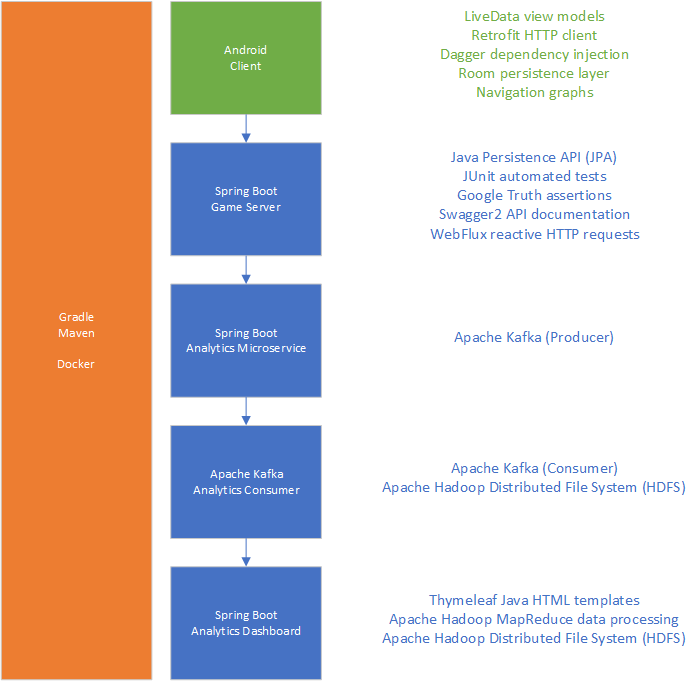

# Mission Runner

Proof of concept Android game with Java game and analytics backend.

* Android Client: https://github.com/npruehs/mission-runner-android
* Spring Boot Game Server: https://github.com/npruehs/mission-runner-server
* Spring Boot Analytics Microservice: https://github.com/npruehs/mission-runner-analytics-microservice
* Apache Kafka Analytics Consumer: https://github.com/npruehs/mission-runner-analytics-consumer
* Spring Boot Analytics Dashboard: https://github.com/npruehs/mission-runner-analytics-hadoop

Visit the respective GitHub repositories to learn more about the features of the services and the details of the tech stack.

All projects use:

* [Gradle](https://gradle.org/#close-notification) or [Maven](https://maven.apache.org/) build automation
* [Docker](https://www.docker.com/) containers
